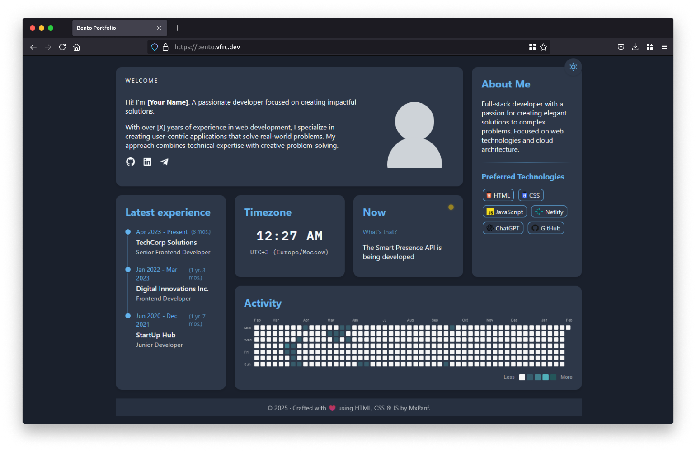

# Simple Bento Portfolio



A minimalist, bento-style portfolio template built with **HTML, CSS, and JavaScript**. This project provides a clean and responsive layout to showcase your personal info, stack, and experience.

## 🚀 Features
- **Bento Grid Layout** - Modern and aesthetically pleasing design.
- **Light & Dark Mode** - Switch themes dynamically.
- **Live Clock** - Displays current time in Your timezone.
- **CodersRank Activity Graph** - Showcases Git contributions.
- **Fully Responsive** - Works on all screen sizes.

## 📂 Project Structure
```
.
├── index.html        # Main HTML file
├── styles.css        # Styling and layout
├── script.js         # JavaScript functionality
├── favicon.svg       # Favicon icon
├── README.md         # Documentation
└── assets/           # Image and media files
```

## 🛠️ Installation & Setup

### 1. Clone the repository
```sh
git clone https://github.com/mxpanf/html-bento-portfolio.git
cd html-bento-portfolio
```

### 2. Open the project
Simply open `index.html` in your browser.

### 3. Customize the project
- **Update your personal information** in `index.html`.
- **Replace your social media links** in the `.welcome-social-links` section.
- **Modify the CodersRank username** (see below).

## 🔗 CodersRank Integration
To display your Git activity graph, follow these steps:
1. **Register an account on CodersRank**: [https://codersrank.io](https://codersrank.io)
2. **Replace your username in `script.js` (line 33)**:
   - Open `script.js` and find this line:
     ```js
     username="nickname"
     ```
   - Replace `nickname` with your **CodersRank username**.

## 🎨 Customization
### Change Theme Colors
Modify `:root` variables in `styles.css`:
```css
:root {
  --primary-color: #222;
  --secondary-color: #333;
  --accent-color: #ffcc00;
}
```

### Replace Icons
Icons are from **Iconify** and can be changed easily:
```html
<span class="iconify" data-icon="mdi:github"></span>
```
Find more icons at [https://icon-sets.iconify.design](https://icon-sets.iconify.design).

## 📜 License
This project is licensed under the **MIT License**. You are free to use, modify, and distribute this code with proper attribution.

## 🤝 Contributing
Contributions are welcome! Feel free to submit a pull request or open an issue.

## 💡 Acknowledgments
Built with ❤️ using **HTML, CSS & JavaScript**.

Inspired by [Bento-like Portfolio](https://github.com/Ladvace/astro-bento-portfolio) from Gianmarco.
